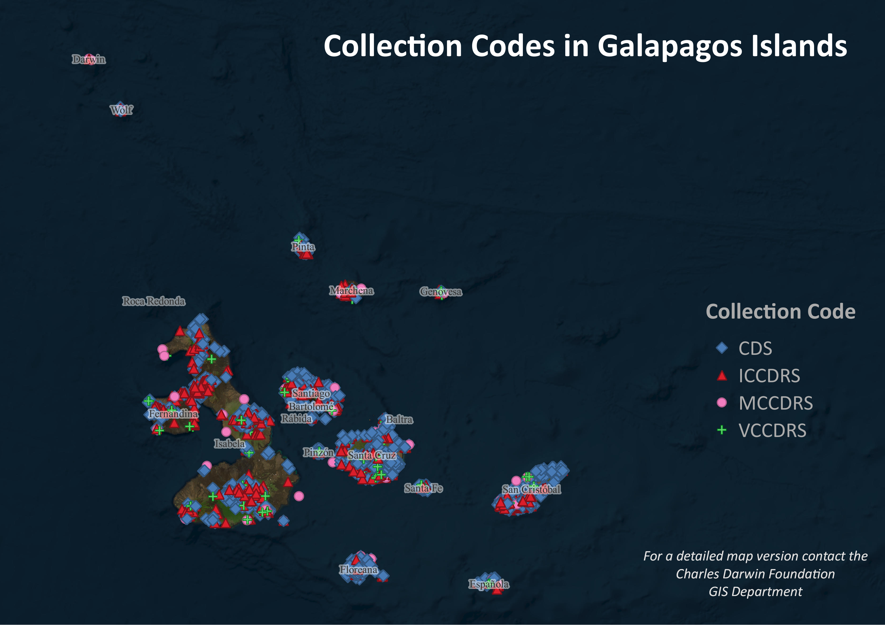
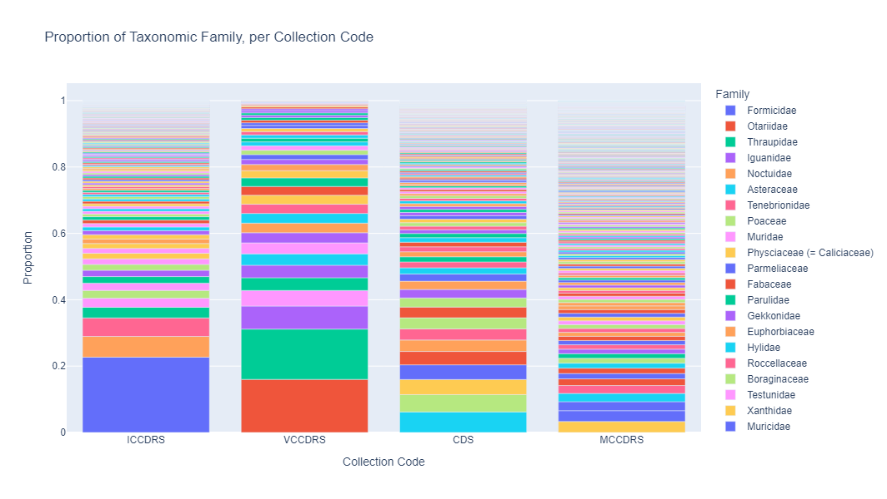
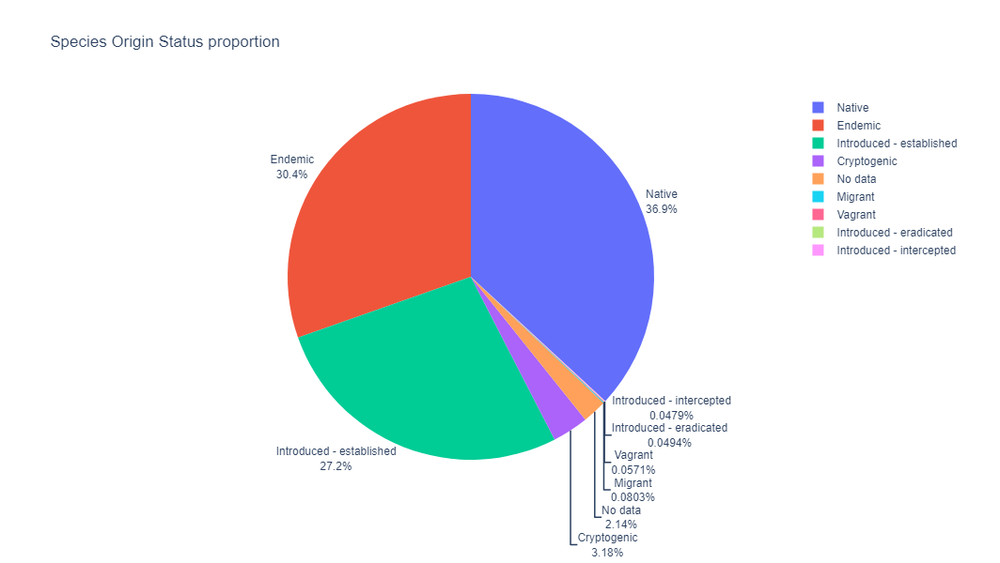
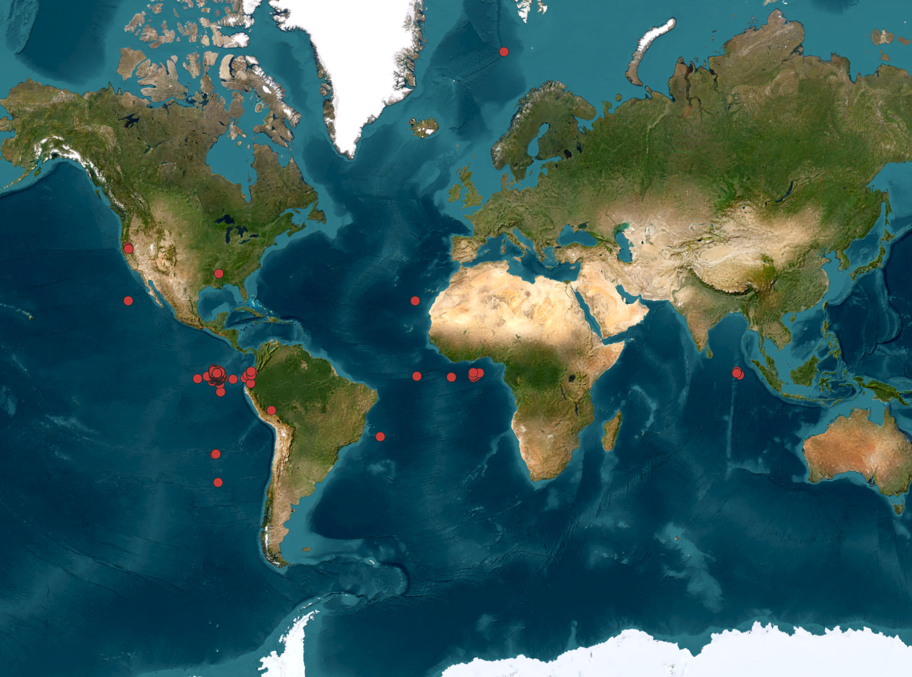

# Specie collection - test at FCD

Find in this repository the code as notebooks, table results (proportions), maps, and QGIS project. 

Note! The data for the QGIS project is hosted in this repository just download it and open it.

## Code (Notebooks)

- [SpCollection-proportions.ipynb](SpCollection-proportions.ipynb)

- [SpCollection-geovisualization.ipynb](SpCollection-geovisualization.ipynb)

This notebooks contains a *Clip* process to get only data contained in Galapagos Islads (data preparation). Find errors in image below.

## Results (tables)

The results of the proportion as tables can be found in the `output` folder.

- [Collection Code and Family proportions](output/CollectioCode_Family_proportion.csv)
- [Specie Origin proportions](output/SpecieOrigin_proportion.csv)

## QGIS project

Download the QGIS project and use it. Data is connected online using this Reposition with data hosted in `viz` folder.

- `geoviz.qgz`
